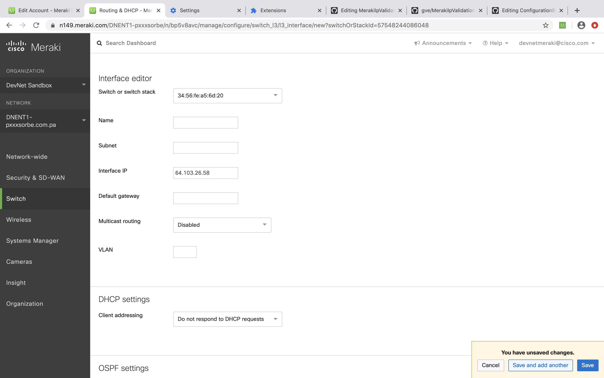

# MerakiIpValidationAutoConfiguration
Chrome extension to automatically assign ip address that is not used on the network yet. Fills the field of the ip address on the Meraki Dashboard Interface editor web-page. 
Uses Meraki Api 'https://api.meraki.com/api/v0/organizations/<org_id>/deviceStatuses'
to check whether ip address from the pool is already assigned on the network. If ip's already used it will choose another ip address from the pool.

## Contacts
* Daria Shantalova (dshantal@cisco.com)

## Solution Components
* Google Chrome - Version 81.0.4044.129 (Official Build) (64-bit)
* Meraki API 'https://api.meraki.com/api/v0/organizations/<org_id>/deviceStatuses' v0  - Documentation https://documentation.meraki.com/zGeneral_Administration/Other_Topics/The_Cisco_Meraki_Dashboard_API

## Business Needs and Challenges
- Need: Network Operator spend much time on validating assigned ip addresses
- Challenge: create a simple and automatic way to choose which ip address can be assigned


## Solution
- This demo utilizes Chrome Extension and Meraki API to build browser extension that can be used to automatically fill the form to assign ip address


## Business Outcomes
- Reduce time network engineers spent on validating ip addresses, decrease the probability of mistakes that can be done by people by using automatic way to check assigned ip addresses

## PoV description


## Architecture


## Launching the PoV:
1) Load this repository to your computer's folder
```shell
git clone https://wwwin-github.cisco.com/gve/MerakiIpValidationAutoConfiguration
```
2) Navigate to the folrder
```shell
cd MerakiIpValidationAutoConfiguration/
```
Delete all files with  .md format. Chrome extension will not work with them. 

3) Open 'iplist.json' file, edit ip addresses that can be assigned in your network, save file

4) Get a Meraki API Key fo your organization 
```shell
https://documentation.meraki.com/zGeneral_Administration/Other_Topics/The_Cisco_Meraki_Dashboard_API
```
5) Open 'main.js' , fill the TOKEN field and organization id ORGID in 'main.js' file with your Meraki API key and organization id, save file

6) Open Google Chrome
7) Go to Google Chrome Settings

8) From settings open extensions 

9) Click on 'load unpacked', chose the folder 'MerakiIpValidationAutoConfiguration' upload

10) Open Meraki Dashboard Interface Editor.

For example go to 
```shell
https://n149.meraki.com/DNENT1-pxxxsorbe/n/bp5v8avc/manage/configure/switch_l3/l3_interface/new?switchOrStackId=57548244086048
```

11)Click on the small green icon with 'M'  on the right conner of your browser, press 'check ip address' button, the 'interface ip' field will be autofilled


### License

Provided under Cisco Sample Code License, for details see [LICENSE](./LICENSE.md)

### Code of Conduct

Our code of conduct is available [here](./CODE_OF_CONDUCT.md)

### Contributing

See our contributing guidelines [here](./CONTRIBUTING.md)


#### DISCLAIMER:

<b>Please note:</b> This script is meant for demo purposes only. All tools/ scripts in this repo are released for use "AS IS" without any warranties of any kind, including, but not limited to their installation, use, or performance. Any use of these scripts and tools is at your own risk. There is no guarantee that they have been through thorough testing in a comparable environment and we are not responsible for any damage or data loss incurred with their use.
You are responsible for reviewing and testing any scripts you run thoroughly before use in any non-testing environment.
